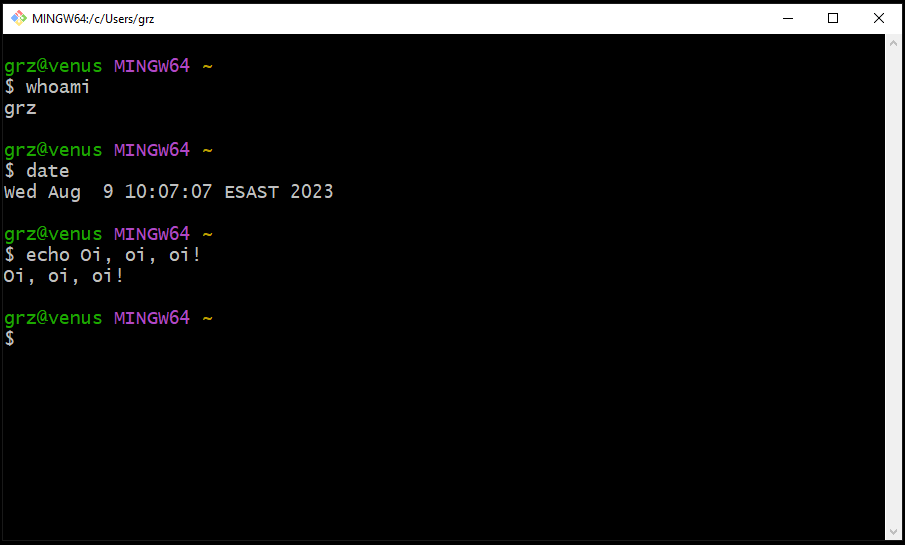

# O shell BASH


Estamos usando o interpretador de comandos "bash", que é o mais comum de encontrarmos em sistemas Linux.

Links para o GNU BASH

- Página do projeto BASH [https://www.gnu.org/software/bash/](https://www.gnu.org/software/bash/)

- Página do mantenedor do projeto BASH, com mais informações sobre o shell - [https://tiswww.case.edu/php/chet/bash/bashtop.html](https://tiswww.case.edu/php/chet/bash/bashtop.html)

A versão que estamos usando é para sistemas Windows e foi instalada junto com o GIT (sitema de controle de versão que usaremos mais adiante).


Link para baixar o GIT+BASH
- [https://git-scm.com/](https://git-scm.com/)

Essa versão do BASH consegue rodar no Windows por causa do suporte de da `MINGW` que é um conjunto de bibliotecas e aplicativos que foram traduzidos do sistema GNU/Linux para o Windows.


O `MINGW` permite que programas como o BASH, que foram escritos para UNIX/LINUX rodem no Windows.

[https://www.mingw-w64.org](https://www.mingw-w64.org)

## Abrindo um terminal BASH no Windows

Para abrir um terminal BASH no Windows você clica no icone do GIT-BASH.


Ele deve estar em sua Área de Trabalho. Se não estiver, use a pesquisa do Windows para encontrar o programa.

Quando você rodar o BASH será aberta uma janela com o fundo preto e um sinal de prompt.


`Janela do BASH no Windows`

## O prompt de comandos do BASH

O prompt é um sinal de que o BASH está pronto pronto para receber um comando.

Normalmente é usado um cifrão (`$`) para representar o prompt. Mas isso é configurável pelo administrador do sistema e também pelos usuários, então pode ser que o prompt que você vai encontrar em um sistema não seja igual a outro.

Exemplo de prompt de comandos do BASH no Windows:

```
prof@iprog MINGW64 ~
$
```

## Primeiros comandos

Para executar um comando no BASH fazemos o mesmo que no CMD do Windows: digitamos uma linha de comando e ao final teclamos `ENTER` para enviar o comando ao BASH, que irá executá-lo.

> A linha de comando sempre inicia com o nome do comando ou programa que será executado. Depois, podem ser digitados parâmetros para esse comando. Os parâmetros são separados por espaços em branco.

Exemplo:

Um comando sem parâmetros
```
$ls
```
Um comando com parâmetros

```
$ls -lah
```

## Comandos para se ambientar no BASH

- `whoami` - mostra o nome do seu usuário
- `date` - mostra a data e hora atuais
- `clear` - limpa a tela
- `echo [uma palavra ou linha de texto]` - repete no terminal o que foi digitado após o comando


`Exemplo de saída dos comandos whoami, date e echo`

