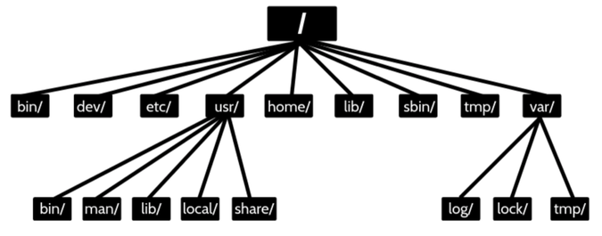
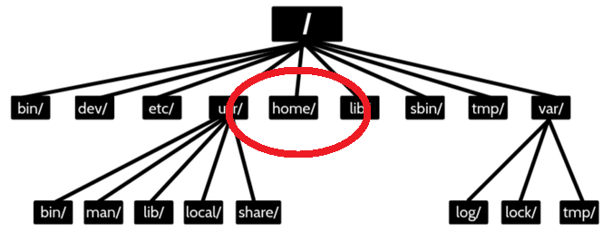

# Trabalhando com diretórios

Diretórios são o lugar onde os arquivos ficam guardados em dispositivos de armazenamento de dados não voláteis, como o SSD, HD, PenDrive, Cartões de memória e outros mais.

Os diretórios formam um estrutura em árvore. 



`Estrutura de diretórios do Linux`

Os diretórios começam pela `Raiz` (Root) da árvore. O nome desse diretório é sempre uma barra `/`.

Abaixo da raíz começam os demais diretórios, que podem conter outros diretórios.

Cada diretório normalmente contém vários arquivos, mas não obrigatoriamente. 

## Diretório HOME

Quandro abrimos um terminal que roda um shell como o BASH, normalmente somos posicionados em nosso diretório HOME, que é o diretório onde nossos arquivos de usuário ficam guardados - por isso o nome HOME (Casa), porque ele é como a nossa "casa" dentro do computador.

Nosso diretório HOME fica dentro do diretório chamado... `home`.



Durante o trabalho no shell nós criamos novos arquivos e novos diretórios para organizar esses arquivos. Nós também saímos do nosso diretório HOME para irmos trabalhar em outros diretórios, quando precisamos acessar outros arquivos.


## Comandos para diretórios

## <code>cd</code> - Muda o diretório de trabalho

CD - Change Directory

Sintaxe:

	cd [caminho para o diretório onde você quer ir]

> Caminho: é formado pela sequência de nomes dos diretórios que devem ser percorridos até chegar a um destino. Os nomes são separados por uma barra - `/`

Exemplo:
	
	$cd /etc
	$cd /home/visitante
	$cd /var/www


## <code>~</code> - Apelido do diretório Home do usuário
Exemplo de uso:

Voltar para o diretório home do usuário atual

```
$cd ~
```

## <code>pwd</code>	- imprime o caminho para o diretório de trabalho

Significa: Print Working Directory (Imprimir Diretório de Trabalho)

> Você usa `pwd` para saber onde você está!

O diretório de trabalho é o diretório onde estamos trabalhando. Esse é o diretório para onde são direcionados os resultados dos comandos por padrão.	
	
## <code>ls</code> - Imprime a lista com os arquivos e diretórios do diretório atual

Sintaxe

	ls [parâmetros] [<caminho do diretório a ser listado>]

Exemplos:

Lista o diretório atual

	$ls	

Lista o diretório atual usando a forma 'longa'

	$ls -l

Lista o diretório /etc, mesmo se não estivermos nele

	$ls /etc

Lista o diretório /etc usando a forma 'longa'

	$ls -l /etc

Lista o diretório atual usando a forma 'longa' e mostrando os aquivos escondidos também

	$ls -la
	

## <code>mkdir</code> - Cria um novo diretório
	
Sintaxe

	mkdir <nome do diretório>

Exemplo

Cria um diretório chamado 'textos' dentro do 
diretório de trabalho

	$mkdir textos

Para criar um diretório dentro de um diretório
diferente do diretório de trabalho, temos que 
dar o caminho completo para esse novo diretório

Exemplo:

Se o diretório textos está no nosso diretório
atual

	$mkdir textos/setembro

cria um subdiretório chamado 'setembro' dentro do
diretório 'textos'

Se o diretório 'textos' está no nosso diretório
atual, e se nosso diretório atual é `/home/aluno`

	$mkdir /home/aluno/textos/outubro

cria um diretório chamado 'outubro' dentro do
diretório textos

O caminho inicial (`/home/aluno`) foi subentendido no primeiro exemplo por tratar-se do diretório atual. Não precisamos escrever sempre o nome do diretório atual quando nos referimos a algo (diretório ou arquivo) que esteja dentro dele.


Exemplo:

Cria todo o caminho para o novo diretório caso os diretório nesse caminho não existam

	$mkdir -p backup/textos/setembro

Se não existe o direório 'backup', por exemplo, o comando cria esse diretório e também todos os outros que estão no caminho informado ao comando

	backup
	  +-textos
		+-setembro

## <code>rmdir</code> - Remove um diretório

Sintaxe

	rmdir <nome do diretório vazio>
> Só é possível remover um diretório quando ele está totalmente vazio. Apague antes todos os arquivos e diretórios contidos nele.

Exemplo

	$rmdir textos


