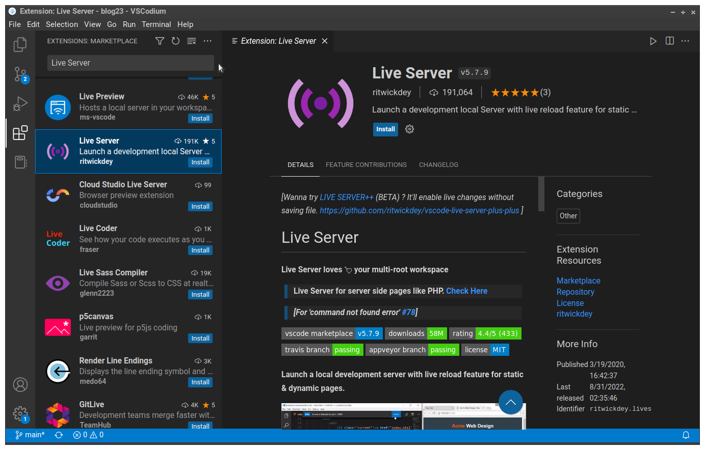

# Instalar um Servidor Web de desenvolvimento

Vamos usar um Servidor Web instalado em nosso próprio computador para fins de desenvolvimento. Vai ser mais prático fazer assim do que ter que transferir para o servidor remoto (o Codeberg, no nosso caso) os arquivos que vamos criando toda vez que eles são modificados ou que precisamos testá-los. 

Esse vai ser nosso Servidor Web **local**. Para instalá-lo vamos usar uma extensão do VSCodium chamado <code>LiveServer</code>.

1. <kbd>Ctrl+Shift+X</kbd> para abrir a aba de gerenciamento das extensões
2. Na caixa de pesquisa (onde o mouse está apontando, na figura abaixo) digite <kbd>live server</kbd>
3. A extensão que queremos é a que está selecionada em azul na figura abaixo
4. Clique no botão azul <code>install</code> que está abaixo do nome, à direita.

<figure>

<figcaption style = "text-align: center">Extensão Live Server</figcaption>
</figure>

Pronto. O Servidor já está instalado. Adiante vamos ver como usá-lo para ver o nosso site funcionando antes mesmo de publicá-lo na Internet.