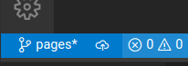

# Publicar ramo

Primeiro, faça os commits normalmente.

Depois, no canto inferior esquerdo, ao lado do nome do ramo atual, você vai ver o botão de publicar ramo. 

<figure>

<figcaption style = "text-align: center">Botão "publish branch" (publicar ramo) é a nuvem com a seta para cima
</figure>

Clique nele para enviar ao codeberg o novo ramo.
