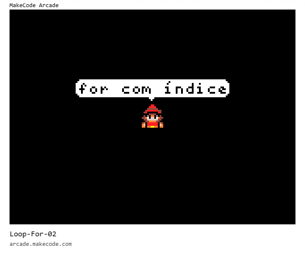

# [Trilha Python](index.md)

## Loops

Loop significa 'volta' ou 'laço', como o *laço* do cadarço de um tênis, por exemplo, que faz duas *voltas*.

Usamos loops para repetir a execução de trechos de código - para fazer um trecho de código *voltar* ao início para ser executado de novo.

### Loop for

Um `loop for` é um tipo de loop usado normalmente para executar um bloco de código uma quantidade `x` de vezes.

Exemplo de código:

Na imagem abaixo está um loop (em verde) que executa um bloco de código 4 vezes. Lemos ele assim: `repita 4 vezes o bloco de código a seguir`.

O bloco de código executado são as linhas de código que estão `dentro do loop`.

A última instrução (`mySprite say "Fim do loop"`) é executada depois que o loop termina.

### Loop for com índice

Um loop for usa uma variável para controlar a contagem de voltas.

A cada volta do loop o valor dessa variável é incrementado. Portanto, a cada volta do loop o valor da variável conterá o número da volta, se é a volta 1, 2, 3, etc... 

> `Importante:` a contagem começa em `0` zero!
> - volta 0
> - volta 1
> - volta 2, etc...

Essa variável índice pode ser usada pelo código que está dentro do loop. Veremos vários usos práticos dessa variável mais adiante.

Exemplo de código:

O código abaixo dá 4 voltas, igual ao exemplo anterior. A diferença é que neste estamos acessando o valor da variável `index` dentro do loop.

Lemos esse loop assim:

`seja 'index' um valor que vai de 0 a 4, para cada valor de 'index' faça o que segue`

Rode o programa e veja o resultado.

## Problemas e soluções

Este é um `loop desenrolado`.

Note que as operações se repetem. A única diferença é o valor de `x` que muda a cada nova chamada da função `set_position()`

### Solução

A solução é transformar essa sequência de operações em um loop. Porém, usaremos uma variável no lugar dos valores de `x`, para podermos variar o valor de `x` a cada execução do loop.

Outra forma de variar o valor de `x` dentro do loop é usando o próprio valor do `índice` (variável `index`, no exemplo) para calcular o valor de `x`.

Neste caso, como queremos que `x` varie de `10 em 10`, podemos multiplicar o valor de `x` por `10` a cada volta do loop quando formos usar `x`.

### [voltar](index.md)
